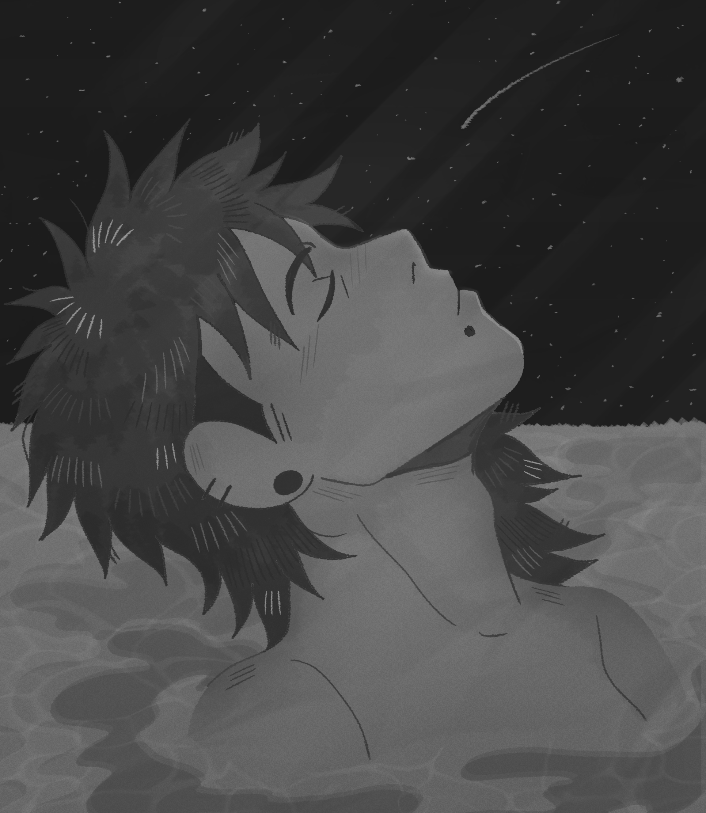
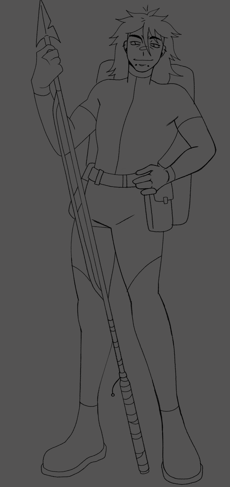
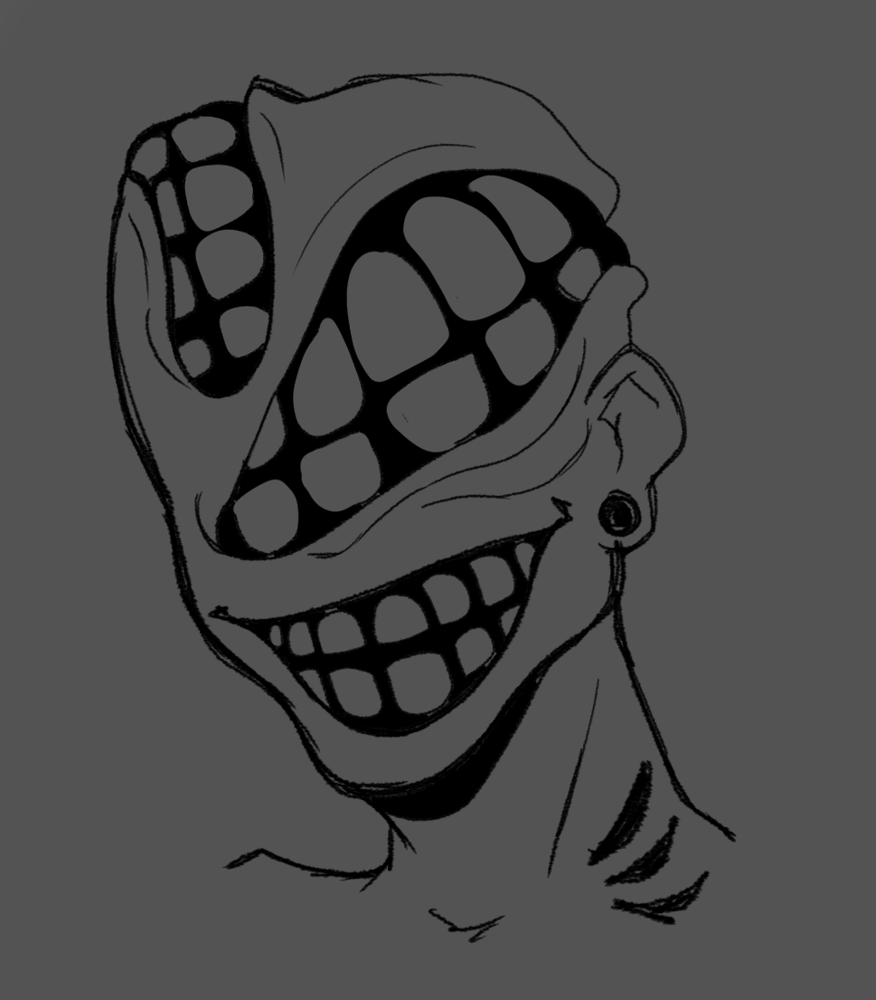
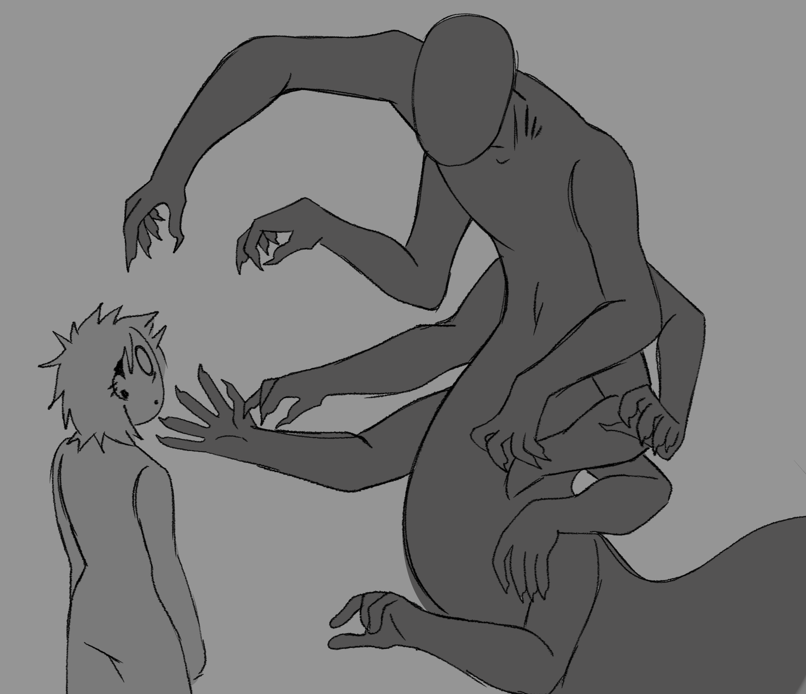
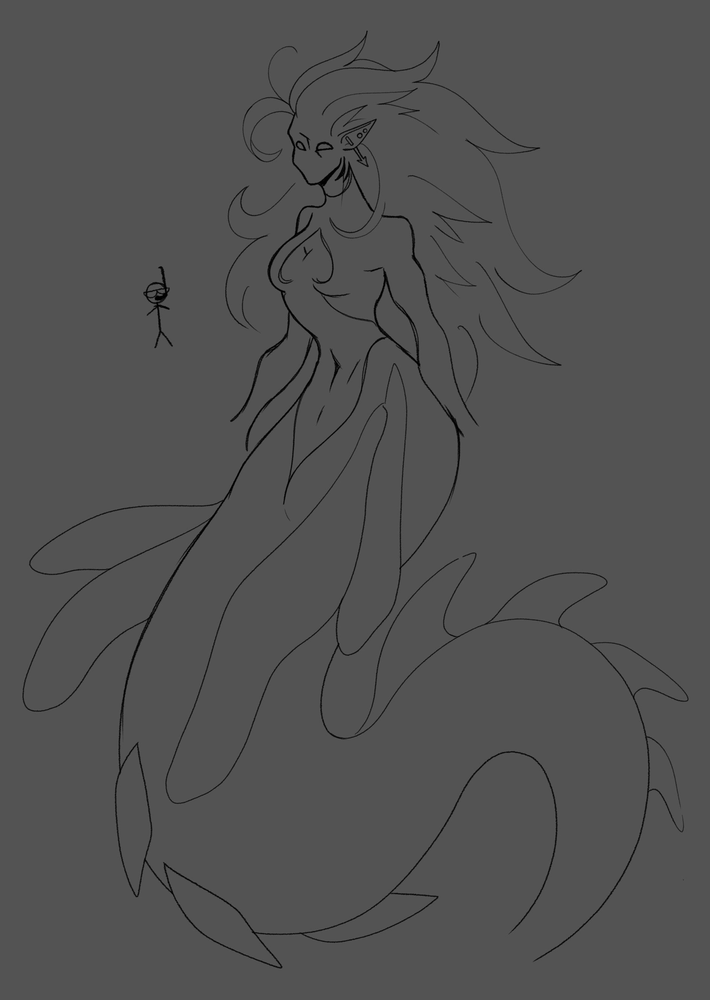
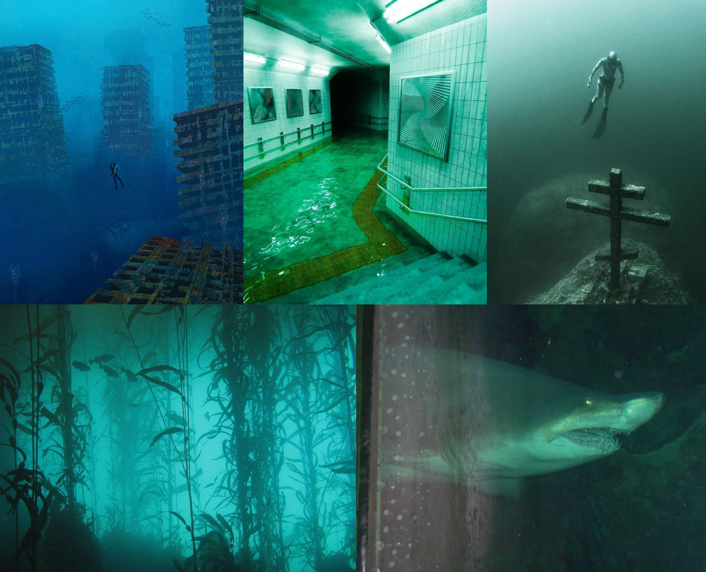

# Тз на разработку игры
* Жанр: хоррор 
* Сеттинг: подводный мир - затопленный город после взрыва лаборатории
* Фишка: крафтинг

## Описание

Это тз описывает разработку хоррор-игры в подводном сеттинге, где игрок исследует затопленный город, собирает ресурсы и крафтит улучшения для выживания. Мир населен мутантами, часть из которых обитает в замкнутых кислородных пузырях, они особенно опасны. В мире действует организация, занимающаяся добычей забытых вещей и документов. Игрок взаимодействует с ее представителями и выполняет задания. Крафтинг является ключевой механикой: улучшение гарпуна, костюма и баллонов влияет на геймплей и открывает новые зоны.

## Задачи

* Создать подводный хоррор с системой крафта и прогрессом предметов.
* Реализовать механику ограниченного кислорода.
* Проработать несколько типов мутантов и их поведение, включая особо опасных мутантов, обитающих в кислородных пузырях.
* Создать систему крафта. Сбор компонентов, рецептов. Апгрейды гарпуна, костюма, баллонов.
* Реализовать систему миссий от организации по добыче артефактов и данных.
* Реализовать инвентарь, интерфейс выживания (hud кислорода, прочности, давления), систему сохранений.
* Разработать звуковую и визуальную атмосферу (напряжение, радиопомехи, приглушенные звуки под водой)

## Требование к функционалу

### Игровой мир

* Общая концепция:

  * Затопленный город. Улицы, подземные переходы, жилые дома, офисы, промышленная зона, крупная затонувшая лаборатория.
  * Уровень вертикальности. Над уровнем города плывущие руины и пузыри кислорода на разных глубинах.
* Наполнение:

  * Лаборатория, архивы, рынок, автотранспорт, подводные туннели.
  * Ресурсы в виде металла, полимеров, электроники, биоматериалов (из мутантов), редких чертежей и файлов.
  * Опасные течения, обвалы, шипы, зоны высокого давления, токсичные выбросы.
* Пузыри воздуха:

  * Встречаются в ограниченных количествах. Внутри открытые зоны без воды, но могут обитать мутанты.
  * Пузыри служат для короткого отдыха и сохранения.

### Выживание и ресурсы

* Кислород:

  * Баллоны с ограниченным объемом.
  * Расход кислорода зависит от активности, состояния костюма и глубины.
  * Пополнение кислорода на базах и станциях организации через крафт новых баллонов.
* Здоровье:

  * Лекарства можно крафтить или находить.
* Давление и температура:

  * На больших глубинах нужно усиленное снаряжение, иначе постепенный урон и поломки костюма.

### Крафтинг и прогресс

* Система крафта:

  * Базовые рецепты доступны сразу. Продвинутые в чертежах и файлах из лаборатории.
  * Компоненты крафта - металл, электроника, уплотнители, биоматериалы, катализаторы.
  * Мобильный набор для полевых ремонтов.
* Предметы для крафта:

  * Базовый гарпун. Модификации: усиленные наконечники, взрывные заряды, электро-заряд, трос-электромагнит, возможность использовать как якорь.
  * Улучшения защиты костюма, устойчивости к давлению, интеграция регенерации кислорода, слоты для модулей.
  * Баллоны: емкость, скорость утечки, фильтры (от ядовитых газов), модуль смены воздуха.
  * Вспомогательные предметы, такие как фонарики, маяки, ловушки, маркеры, кислородные капсулы, аптечки.
* Прокачка:

  * Уровни и очки навыков или прогресс через улучшения предметов и чертежи.
  * Каждый апгрейд имеет цену компонентов и редких материалов.

### Враги и встречи

* Типы мутантов:

  * Мелкие: быстрые, атакуют группами. Дают базовые материалы.
  * Средние: агрессивные, используют укрытия, могут вызывать панические эффекты.
  * Пузырьковые: проживают в кислородных пузырях. Сильные, часто защищенные. Отдельные идут как боссы или мини-боссы.
  * Лабораторные: мутанты с аппаратными имплантами.
* Поведение:

  * Патрулирование, реакция на звук или свет, охота в стаях.
* Бои:

  * Важность позиционирования в воде: движение влияет на точность и скорость.

### Квесты и организация

* Организация:

  * Дает задания: добыть документы, вернуть образцы, зачистить локации.
  * Торговец-инженер: покупка, ремонт, обмен предметов и чертежей.
* Типы квестов:

  * Сюжетные миссии: движение по основной линии.
  * Побочные: поиск предметов, спасение экипажа, зачистка.
  * Разовые рейды на особенно опасные локации.
* Награды:

  * Ресурсы, чертежи, улучшения и доступ к новой экипировке.

### Интерфейс и управление

* Hud:

  * Кислород, здоровье, прочность костюма, давление.
  * Слоты быстрого доступа для аптечек, капсул, веревок и гарпуна.
* Инвентарь:

  * Слотовый. Ограничение инвентаря обязательно.
  * Окна крафта и описания предметов, рецептов.
* Управление:

  * Плавание: толчок, погружение, всплытие. привязка к якорю.
  * Бой: метание и стрельба гарпуном, колющий, рубящий урон, использование ловушек.

### Звук и музыка

* Подводная звуковая среда: приглушенные звуки, эхо, давление в ушах, скрипы металлла.
* Музыка: напряженный эмбиент, масштабируемый и реагирующий на угрозу.

### Сохранения и прогресс

* Сохранения:

  * Автосейв в безопасных пузырьках или базах. Контрольные точки.
  * При высоком уровне сложности опционально режим с суровым сохранением (ограниченные сейвы, перманентная потеря предметов)
* Прогресс игрока:

  * Крафт-дерево, открытия чертежей, улучшения экипировки, сюжетный прогресс.

<!-- ## Дополнения

* Здесь находится несколько скетчей атмосферы игры, монстры, персонажи, мудборд.

 -->